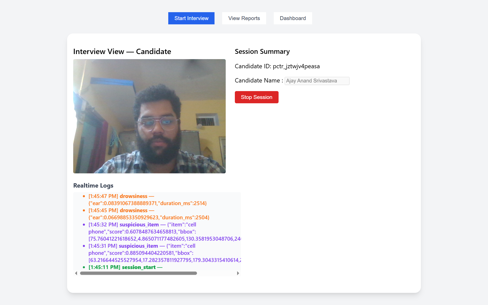
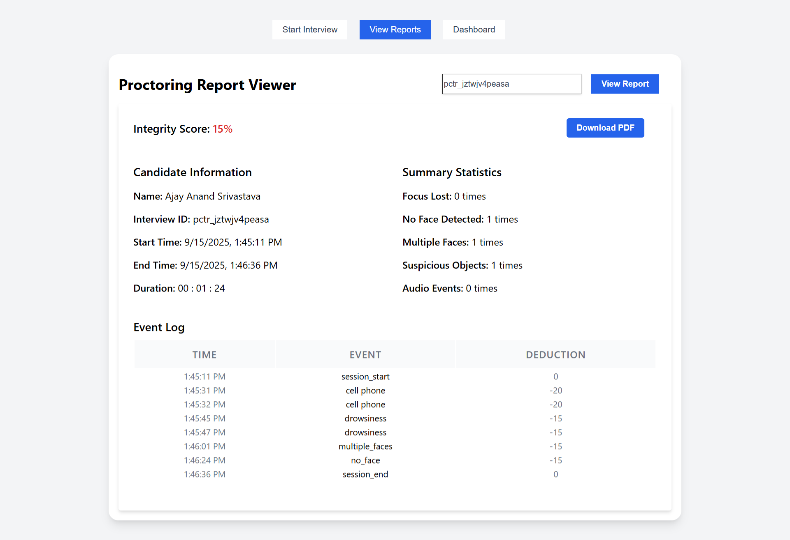
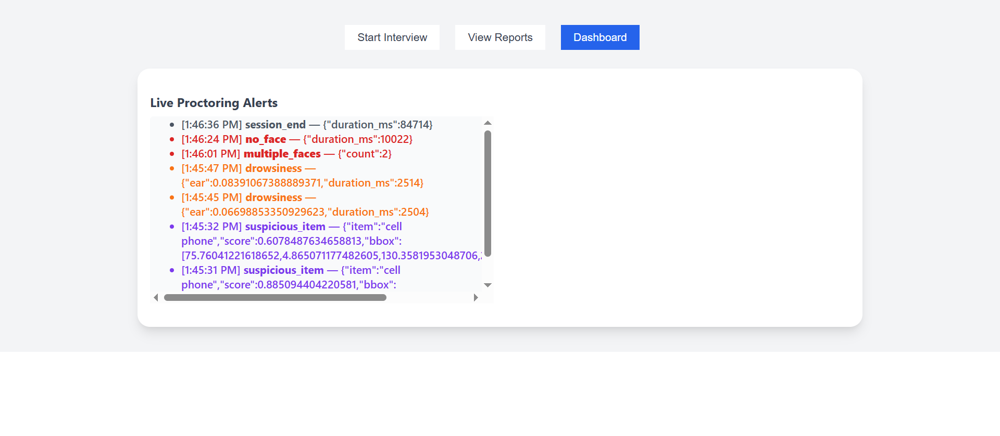
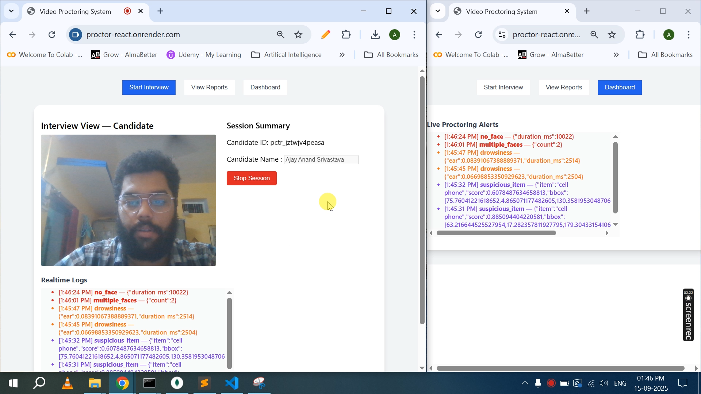
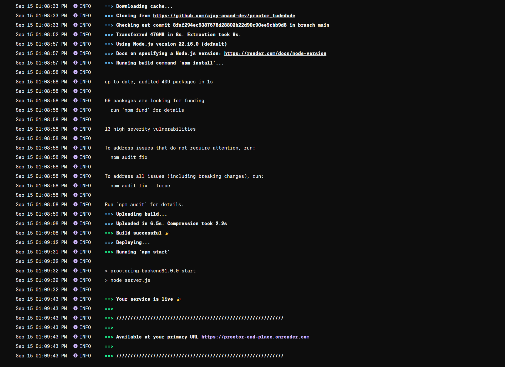

# 🎥 Proctor Tutedude – AI-Powered Video Proctoring System


An **end-to-end video proctoring solution** that detects candidate focus, flags unauthorized objects, and logs suspicious activity in real-time.  
Deployed on **Render** for both frontend and backend.

---

## 🌐 Live Demo

🔗 **Frontend:** [https://proctor-react.onrender.com/](https://proctor-react.onrender.com/)  
🔗 **Backend API:** [https://proctor-end-place.onrender.com/](https://proctor-end-place.onrender.com/)

---

## ✨ Features

✅ **Real-time Candidate Monitoring** – Detects multiple faces, looking away, and drowsiness  
✅ **Suspicious Object Detection** – Phone, book, secondary screen, and more  
✅ **Video Uploads** – Saves candidate video sessions for later review  
✅ **Auto-Generated Reports** – Integrity score calculation with downloadable PDF  
✅ **Live Dashboard** – Real-time logs and alerts for interviewers  
✅ **Fully Deployed** – Backend + frontend running on Render  

---

## 📸 Screenshots

### 🖥️ Frontend – Candidate Proctoring Screen  


### 📊 Report – Report And Download Pdf  


### 📊 Dashboard – Live Alerts  


### 📊 Socket – View Together  


### 🛠️ Backend – Logs / API Test  


> 📂 Place your screenshots inside `/screenshots/` folder so they appear here automatically.

---

## 🏗️ Tech Stack

- **Frontend:** React (with Hooks), TailwindCSS  
- **Backend:** Node.js, Express.js  
- **Database:** MongoDB Atlas  
- **Real-Time:** Socket.IO  
- **AI/ML:** TensorFlow.js, MediaPipe (FaceMesh)  
- **Deployment:** Render (Free Tier)  

---

## 📂 Project Structure

```bash
proctor_tudedude/
│
├── backend/
│   ├── server.js           # Express + Socket.IO + MongoDB
│   ├── uploads/            # Saved video sessions
│   ├── .env.example
│   └── package.json
│
├── frontend/
│   ├── src/                # React components
│   ├── public/
│   ├── .env.example
│   └── package.json
│
├── screenshots/            # <--- add screenshots here
└── README.md
